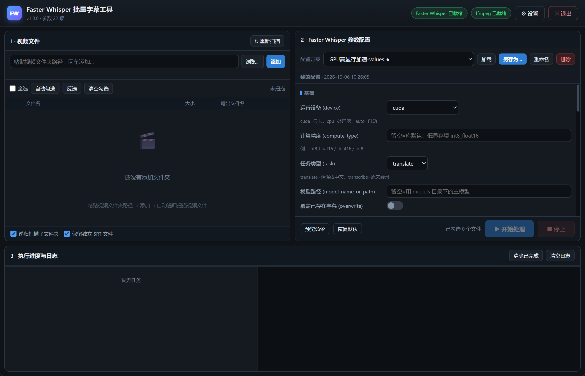

# UnblurSub

[](https://learn.microsoft.com/windows)
[](https://www.python.org/)
[](./LICENSE)
[](./selftest.py)

**给[Faster-Whisper-TransWithAI-ChickenRice](https://github.com/TransWithAI/Faster-Whisper-TransWithAI-ChickenRice)套一层 Windows 桌面 GUI的批量字幕工具。**

原版只能拖单个文件进 `.bat`，参数写死在脚本里。本工具把「加文件夹 → 勾选 → 选参数配置 → 批量出片」做成一个窗口，串行队列逐个处理，**封装阶段零重编码**（`-c copy`）。

---

## 目录

- [特性](#特性)
- [快速开始](#快速开始)
- [打包成 exe](#打包成-exe)
- [使用流程](#使用流程)
- [命名规则](#命名规则)
- [内置参数配置](#内置参数配置)
- [容器支持矩阵](#容器支持矩阵)
- [配置存放位置](#配置存放位置)
- [安全性设计](#安全性设计)
- [项目结构](#项目结构)
- [常见问题](#常见问题)
- [开发与测试](#开发与测试)
- [License](#license)

---

## 特性

| 能力 | 说明 |
|------|------|
| **批量处理** | 粘贴/ 浏览添加视频文件夹，递归扫描，可单勾 / 全选 / 反选 / 清空；串行队列一次跑一个 `infer.exe`，不会把显存和内存撑爆 |
| **自动跳过已处理** | 一键「自动勾选」= 勾选文件名后缀**不含** `-C` / `-UC` 的文件（`-U` 是待翻译源文件，会被正常勾选） |
| **参数可视化** | 22 项参数按 6 个分组呈现（基础 / 输入输出 / VAD 切分 / 字幕合并 / 批处理 / 高级），内置 7 套开箱即用配置 |
| **配置另存** | 改完参数可「另存为…」自己的配置，支持重命名 / 覆盖 / 删除；内置配置受保护不可删 |
| **零重编码封装** | `ffmpeg -c:v copy -c:a copy`软封装，视频流与音频流原样保留，仅新增一条字幕轨 |
| **中文字幕轨** | 封装时写入 `title=中文字幕` + `language=chi`（mp4 额外写 `handler_name`），播放器直接显示为中文字幕 |
| **自动保存** | 关窗前落盘全部设置；参数改了没存配置时会弹窗询问「保存为新配置 / 丢弃 / 取消」 |
| **三级窗口降级** | pywebview（原生 WebView2）→ Edge `--app` 窗口 → 系统默认浏览器，任何环境都能打开 |
| **完整日志** | 每个文件记录完整命令行、`infer.exe` 原始输出；界面里可预览任意文件的待执行命令 |
| **可离线自测** | `selftest.py` 覆盖 192 项断言，零外部依赖，`python selftest.py` 即可验证 |

---

## 快速开始

### 前置依赖

| 依赖 | 说明 |
|------|------|
| **Faster-Whisper-TransWithAI** | 必需。Windows 版解压后目录内含 `infer.exe` / `models` / `generation_config.json5` |
| **ffmpeg** | 必需。用于封装字幕。程序会自动在 `PATH` 与常见安装位置查找（含 `imageio-ffmpeg` 自带版本），也可在设置里手动指定 |
| **Python 3.10+** | 仅「直接运行」需要。打包 exe 给同事用时，他们**不需要**装 Python |

### 运行

```bash
git clone https://github.com/zyy19930304/UnblurSub.git
cd UnblurSub
pip install -r requirements.txt
python app.py
```

启动后按提示填入 Faster-Whisper-TransWithAI 所在目录（**含 `infer.exe` 的那一层**）。程序会校验 `infer.exe`、`models`、`generation_config.json5` 是否存在，顶栏显示就绪状态。

### 打包成 exe

```bat
build.bat
```

产物在 `dist\FWSubsBatch\FWSubsBatch.exe`（约 27 MB）。

> **分发时必须整个 `dist\FWSubsBatch` 文件夹一起压缩**，不能只发 exe——PyInstaller onedir 模式依赖同目录的 `_internal`。
>
> 目标机器无需装 Python，但需要 **WebView2 运行时**（Win10/11 自带，Win7 需单独下载）。缺 WebView2 时程序会自动降级用 Edge / 浏览器打开。

### 打包脚本做了什么

`build.bat` **不使用系统 Python，而是自建 `.venv` 独立虚拟环境**：

```
[1/6] 定位可用的 python（优先 py -3，其次 python）
[2/6] 创建 / 复用 .venv
[3/6] 升级 pip
[4/6] 安装 requirements.txt
[5/6] 跑 selftest（不通过则中止打包）
[6/6] PyInstaller onedir 打包
```

**为什么要自建venv**：Windows 上常同时存在多个 Python（Microsoft Store 的 `WindowsApps\python.exe` 占位符、conda、托管环境……），直接 `pip install` 装到哪个解释器完全取决于 `PATH` 顺序，极不可控。自建 venv 后，第 4 步之后所有依赖都锁死在 `.venv` 里。

**`.venv`、`build/`、`dist/` 都可以随时删除**，删掉后重跑 `build.bat` 即可。

---

## 使用流程



1. **添加文件夹** —— 粘贴路径或点「浏览…」选目录，程序递归列出视频文件
2. **勾选** —— 「自动勾选」一键排除已处理的 `-C` / `-UC` 产物；列表里直接显示每个文件的输出名预览
3. **选配置** —— 下拉挑一套内置方案，或加载自己的配置后微调再「另存为」
4. **开始** —— `Ctrl+Enter` 或点「开始处理」，逐个文件走完整流水线

**快捷操作**

- `Ctrl+Enter` —— 快速开始处理
- **预览命令** —— 生成某个文件将要执行的完整 `infer.exe` 命令行，便于排查参数问题
- **✕ 退出** —— 落盘设置；若参数未保存会先弹窗确认

---

## 命名规则

**输出命名**

```
第01话 开场.mp4      → 第01话 开场-C.mp4      （加 -C）
第02话 剧情-U.mp4    → 第02话 剧情-UC.mp4     （原本名以 -U 结尾，把 -U 改成 -UC）
第01话 开场-C.mp4    → 第01话 开场-C-C.mp4    （已是 -C，再处理会再叠一层）
```

> **规则版本**：自动勾选规则曾在 v2 从「排除 `-U` / `-UC`」改为「排除 `-C` / `-UC`」。
> 升级后程序会**自动作废旧的勾选记录并按新规则重算**，无需手动清理。
> 旧配置已备份在 `%APPDATA%\FWSubsBatch\settings.json.bak`。

**同名输出策略**（设置里可选）

| 策略 | 行为 |
|------|------|
| `number`（默认） | 自动加序号 `xxx-C (2).mp4`，**永不覆盖** |
| `skip` | 已存在则跳过该文件 |
| `overwrite` | 覆盖 |

---

## 内置参数配置

| 配置名 | 对应原版 .bat | 关键参数 |
|--------|----------------|----------|
| 翻译 · GPU（默认） | `运行(翻译)(GPU).bat` | `device=cuda, task=translate` |
| 翻译 · CPU | `运行(翻译)(CPU).bat` | `device=cpu` |
| 翻译 · GPU 低显存 | `运行(翻译)(GPU,低显存模式).bat` | `compute_type=int8_float16` |
| 翻译 · GPU 高显存加速 | `运行(翻译)(GPU,高显存加速模式).bat` | `enable_batching, max_batch_size=8` |
| 翻译 · GPU（字幕输出到「输出」文件夹） | `运行(翻译)(GPU)(输出到当前文件夹).bat` | `output_dir=输出` |
| 转录 · GPU（原文，不翻译） | — | `task=transcribe` |
| 转录 · GPU 低显存（原文） | — | `task=transcribe, int8_float16` |

内置配置**不可删除 / 重命名**（受保护）。需要改就「另存为…」成自己的配置。

---

## 容器支持矩阵

软封装能力取决于容器能否承载字幕流：

| 容器 | 字幕编码器 | 软封装 |
|------|-----------|--------|
| `mp4` / `m4v` / `mov` | `mov_text` | ✅ |
| `mkv` | `srt` | ✅ |
| `webm` | `webvtt` | ✅ |
| `ts` / `mts` / `m2ts` | `mov_text` | ✅ |
| `avi` / `wmv` / `flv` / `mpg` / `rmvb` … | — | ❌ 自动改输出 `.mkv` 并在日志提示 |

---

## 配置存放位置

```
%APPDATA%\FWSubsBatch\
  settings.json           所有设置（FW 路径、文件夹、勾选状态、窗口尺寸…）
  profiles.json           自定义参数配置
  settings.json.bak       规则版本迁移时的旧配置备份
  webprofile/             Edge 应用窗口的用户数据
  work/                   临时工作目录（每个任务结束自动清理）
```

配置读写走**原子写入**（临时文件 + `os.replace`），中途断电不会写出半截 JSON。

---

## 安全性设计

- **永不静默覆盖** —— 默认加序号；封装先写 `.part` 临时文件，成功后才 `os.replace` 改名，避免半成品
- **空字幕拦截** —— SRT 解析出 0 条时判失败并清理，不会产出「有画面没字幕」的空壳文件
- **不覆盖原文件** —— 源视频只读，输出始终是新文件
- **临时目录必清理** —— 无论成功 / 失败 / 取消，工作目录都在 `finally` 里删掉
- **失败保留证据** —— `infer.exe` 的退出码与原始输出完整进日志，不做二次包装
- **可中断** —— 停止时通过 pidfile + `psutil` 定位并终止正在跑的 `infer.exe` 子进程

---

## 项目结构

```
UnblurSub/
├── app.py              # 桌面程序入口：参数解析 + 三级窗口降级 + 退出联动
├── server.py           # 本地 HTTP 服务 + JSON API（纯标准库 ThreadingHTTPServer）
├── core.py             # 核心逻辑层：参数 schema、命令构造、命名规则、扫描、封装
├── jobs.py             # 任务队列与流水线：infer 转录 → SRT 校验 → ffmpeg 封装
├── selftest.py         # 192 项断言的自测套件（零外部依赖）
├── build.bat           # 自建 venv + 跑自测 + PyInstaller onedir 打包
├── requirements.txt
└── web/                # 前端（原生 HTML/CSS/JS，无框架无构建）
    ├── index.html
    ├── app.js
    └── style.css
```

**分层约定**：`core.py` **不依赖任何界面 / 网络库**，可单独 `import` 做单元测试——这是 `selftest.py` 能零依赖跑起来的前提。改业务逻辑只动 `core.py` / `jobs.py`，前端只通过 `/api/*` 通信。

<details>
<summary>HTTP API 一览（22 个端点）</summary>

```
GET  /api/state              POST /api/start
GET  /api/drives             POST /api/stop
POST /api/browse             GET  /api/job/state
POST /api/scan               GET  /api/job/logs
POST /api/add_folder         POST /api/job/clear_finished
POST /api/remove_folder      POST /api/preview_cmd
POST /api/set_selected       POST /api/shutdown_prompt
GET  /api/profiles           POST /api/shutdown
POST /api/profile/save       POST /api/save_settings
POST /api/profile/delete     POST /api/validate_fw
POST /api/profile/rename     POST /api/pick_default_fw
                             POST /api/reveal
```

服务仅监听 `127.0.0.1`，不对外暴露。

</details>

---

## 常见问题

**Q：提示「字幕内容为空（可能无人声或识别失败）」**
A：原版 Faster-Whisper 的模型锁定 `language: ja`，只处理日语。英语等其他语言会输出 0 字节 SRT。可在参数里把 `task` 改为 `transcribe` 配合多语言模型。

**Q：提示容器不支持软封装**
A：`avi` / `wmv` / `flv` 等容器无法承载字幕流，程序已自动改为输出 `.mkv`。若想保留原格式，请先用 ffmpeg 转成 mp4 再处理。

**Q：显存不足 / CUDA 报错**
A：切到「翻译 · GPU 低显存」配置，或「翻译 · CPU」。

**Q：想跳过已处理过的文件**
A：点「自动勾选」，程序会自动排除文件名以 `-C` / `-UC` 结尾的**已处理产物**。注意 `-U` 结尾的是**待翻译的源文件**，会被正常勾选（输出为 `-UC`）。

**Q：窗口打不开 / 白屏**
A：程序有三级降级（pywebview → Edge 应用窗口 → 系统浏览器）。可加 `--browser` 强制用浏览器打开，或 `--server-only` 只起服务再手动访问。

**命令行参数**

```bash
python app.py --server-only   # 只起本地服务，不开窗口（调试）
python app.py --port 8760     # 指定端口（默认随机可用端口）
python app.py --no-webview    # 跳过 pywebview，直接走 Edge / 浏览器
python app.py --browser       # 强制用系统默认浏览器打开
```

**Q：`build.bat` 报「Dependency installation failed」**
A：装依赖失败，通常是网络或代理问题。脚本会打印 pip 的原始报错。可手动重试：`.venv\Scripts\python.exe -m pip install -r requirements.txt`

**Q：`build.bat` 双击后窗口一闪而过**
A：脚本里的错误提示都跟着 `pause`，正常失败会停住等你按键。若确实闪退，用命令行跑能看到完整输出：`cd到目录 && build.bat`

**Q：`build.bat` 提示「Python not found in PATH」**
A：装Python 3.10+ 时勾选「Add python.exe to PATH」，或直接用 `py` 启动器（脚本会优先尝试 `py -3`）。

---

## 开发与测试

```bash
python selftest.py      # 192 项断言，不需要 GPU / 网络 / 任何外部程序
```

覆盖范围：

- 命名规则（中文名、空格、`-U` / `-UC` / `-C` 各种组合）
- 自动勾选规则（小写 `-c` / `-uc`、名字中间含 `-C` / `-U`、`-U` 源文件会被勾选）
- 命令构造（22 项参数、三态参数、空值不传、与原版 5 个 `.bat` 的一致性）
- 封装参数（`-c:v copy` / `-c:a copy` / 轨道名 / 各容器编码器 / 非法容器报错）
- SRT 规整（BOM、GBK 回退、换行统一、条数识别、空文件）
- 输出路径与三种覆盖策略
- 递归扫描、扩展名过滤、隐藏目录跳过
- 配置持久化（保存 / 重名报错 / 覆盖 / 删除 / 内置保护 / 原子写入）
- HTTP 路由签名一致性、前端容错（`undefined` 安全读取）

**真实端到端验证**：日语语音样本 3 个文件（`mp4` / `-U.mp4` / `mkv`），GPU 转录全部成功，日译中字幕正确，轨道名为「中文字幕」，视频 h264 / 音频 aac 原样保留（未重编码），时长一致。

**提交前请跑一遍 `selftest.py`** —— `build.bat` 也会自动跑，跑不过直接中止打包。

---

## License

MIT © zyy19930304

本工具是 [Faster-Whisper-TransWithAI](https://github.com/readbeyond/Faster-Whisper-TransWithAI) 的 GUI 前端，不包含其代码；Faster-Whisper / Whisper 模型本身遵循其各自的许可证（MIT / MIT-CC-BY 等），请自行遵守。