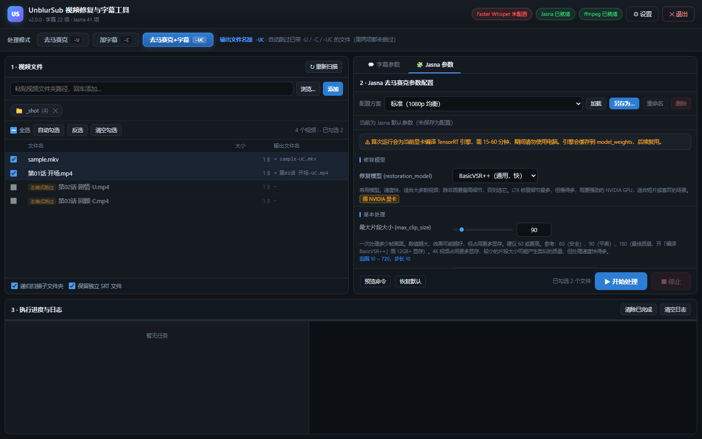

# UnblurSub

[](https://learn.microsoft.com/windows)
[](https://www.python.org/)
[](./LICENSE)
[](./selftest.py)

**马赛克去除 + 中文字幕生成的 Windows 批量桌面工具。**

把 **[Jasna](https://github.com/Kruk2/jasna)**（AI 马赛克修复）与
**[Faster-Whisper-TransWithAI-ChickenRice](https://github.com/TransWithAI/Faster-Whisper-TransWithAI-ChickenRice)**
（日语音视频转录翻译）整合到一个窗口：选好处理模式，批量导入视频，剩下的交给队列。

---

## 目录

- [致谢](#致谢)
- [处理模式](#处理模式)
- [命名与跳过规则](#命名与跳过规则)
- [安装准备](#安装准备)
- [编译方法](#编译方法)
- [使用方法](#使用方法)
- [界面说明](#界面说明)
- [Jasna 参数配置](#jasna-参数配置)
- [配置文件位置](#配置文件位置)
- [安全性设计](#安全性设计)
- [常见问题](#常见问题)
- [开发与测试](#开发与测试)
- [许可与免责声明](#许可与免责声明)

---

## 致谢

本工具**没有一行去马赛克或语音识别的核心算法**——它做的是把两个成熟的开源项目
组织起来，让它们配合同一个命名规则、同一个队列、同一个界面协同工作。
因此必须首先向这两个项目的作者与贡献者致以诚挚的谢意。

### [Jasna](https://github.com/Kruk2/jasna)

**AI 视频马赛克修复工具**，作者 [Kruk2](https://github.com/Kruk2)。

本工具的「清除马赛克」能力**完全由 Jasna 提供**。本工具所做的，是把它的
41 项 GUI 配置项完整搬进自己的界面（说明文案取自其源码中的中文 tooltip），
并通过其命令行接口逐文件调用，从而纳入统一的批处理队列。

- 修复引擎（BasicVSR++ / LTX）、检测模型（RF-DETR / YOLO）、TensorRT 加速、
  交叉淡入淡出、镜头切换检测、VR180 处理等能力，均来自 Jasna 的实现
- 官方仓库：<https://github.com/Kruk2/jasna>
- 许可：应用源码 **AGPL-3.0-only**（模型权重各有独立条款）
- ⚠️ **官方要求安装路径仅含英文与数字**，且需 NVIDIA GTX 16 系 / RTX 20 系
  及以上显卡（算力 7.5+）。本工具会在设置里检测并提示中文路径问题

Jasna 本身还向以下开源项目致谢，本工具间接使用了它们的能力：

- **[Lada](https://codeberg.org/ladaapp/lada)** —— 马赛克检测与修复的基础模型与代码
- **[ZeLeFans](https://github.com/ZeLeFans)** —— VR180 检测模型与马赛克形状分析
- **[RF-DETR](https://github.com/roboflow/rf-detr)** / **Ultralytics YOLO** —— 目标检测
- **Lightricks LTX-2.5** —— LTX 修复模型（社区许可授权）
- **NVIDIA TensorRT** —— 推理加速

### [Faster-Whisper-TransWithAI-ChickenRice](https://github.com/TransWithAI/Faster-Whisper-TransWithAI-ChickenRice)

**日语音视频转录与翻译工具**，由 [AI汉化组](https://t.me/transWithAI) 开发维护，
基于 [SYSTRAN/faster-whisper](https://github.com/SYSTRAN/faster-whisper) 优化。

本工具的「生成中文字幕」能力**完全由它提供**。本工具通过其 `infer.exe`
命令行接口调用，并把其原有的 5 个 `.bat` 启动方式抽象为界面上的配置方案
（GPU / CPU / 低显存 / 高显存加速 / 输出到指定文件夹等）。

- 「海南鸡 v2」日译中模型基于 5000 小时音频数据训练，专门优化日→中场景
- 支持 NVIDIA CUDA 11.8 / 12.2 / 12.8，以及 AMD ROCm/HIP
- 字幕格式、音声优化 VAD、批处理参数等均来自该项目
- 许可：**MIT**

### 其他

- **[FFmpeg](https://ffmpeg.org/)**（LGPL / GPL）—— 字幕封装与格式转换
- **[Open Faster Whisper](https://github.com/SYSTRAN/faster-whisper)** 与
  **Whisper](https://github.com/openai/whisper)**（MIT / MIT-CC-BY）—— 语音识别模型

**本项目自身**以 MIT 许可开源，是上述项目的**独立 GUI 集成前端**，
不包含、不修改、不重新分发二者的任何代码或模型。

---

## 处理模式

顶部三个按钮对应三条流水线。这是本工具最核心的设计——**你要什么，就只做什么**。
去马赛克必须重新编码（AI 逐像素重建画面，物理上无法 copy），代价很高，
没必要跑的步骤一律不跑。

| 模式 | 做什么 | 依赖 | 输出后缀 |
|------|--------|------|---------|
| **1 · 只清除马赛克** | Jasna 修复画面 | Jasna | `-U` |
| **2 · 只生成中文字幕** | Whisper 转录 + 软封装 | ChickenRice + ffmpeg | `-C` |
| **3 · 清除马赛克 + 生成中文字幕** | 先去马赛克，再给结果加字幕 | 两者都要 | `-UC` |

模式 3 的两阶段串行执行：

```
源文件 ──[Jasna]──> 中间视频 ──[infer.exe 转录]──> SRT ──[ffmpeg -c copy]──> 最终文件
```

进度条分段推进：去马赛克约占 0–70%，转录封装占 70–100%。

切换模式时界面自动联动——不需要的参数面板置灰、文件列表的输出名与勾选状态立即重算。

---

## 命名与跳过规则

**后缀语义**：`-U` = 已去马赛克，`-C` = 已加中文字幕，`-UC` = 两者都有。

### 输出命名

| 模式 | 原文件名 | 输出 | 说明 |
|------|---------|------|------|
| 1 | `ABC.mp4` | `ABC-U.mp4` | 加 `-U` |
| 1 | `ABC-C.mp4` | `ABC-UC.mp4` | 已有字幕，加去马赛克后升级为 `-UC` |
| 2 | `ABC.mp4` | `ABC-C.mp4` | 加 `-C` |
| 2 | `ABC-U.mp4` | `ABC-UC.mp4` | 已去马赛克，加字幕后升级为 `-UC` |
| 3 | `ABC.mp4` | `ABC-UC.mp4` | 一律 `-UC` |

### 自动跳过

处理前检查文件名后缀，已做过的处理不会重复劳动：

| 模式 | 跳过的文件 | 原因 |
|------|-----------|------|
| 1 | `*-U`、`*-UC` | 马赛克已经去过了 |
| 2 | `*-C`、`*-UC` | 中文字幕已经加过了 |
| 3 | `*-U`、`*-C`、`*-UC` | 两项都做过才能是 `-UC`，无法在已处理文件上叠加 |

「自动勾选」按钮按当前模式智能跳过；被跳过的文件在列表里显示
**橙色「本模式跳过」标签**并置灰，鼠标悬停可看具体原因。
手选框仍可勾选——真要强制处理就手动勾，日志里会留记录。

大小写不敏感：`abc-c`、`abc-uc` 同样识别为已处理。

> **规则版本**：v3 起命名与跳过规则由处理模式决定。旧版本（v2 及以前）的
> 勾选记录会**自动作废并按当前模式重算**，无需手动清理。

---

## 安装准备

本工具是**纯前端集成壳**，不内置任何一个依赖程序。请先自行下载准备好下面三项。

### 1. Jasna（模式 1 / 3 必需）

- 下载：<https://github.com/Kruk2/jasna/releases>（选 Windows + 你的显卡厂商版本）
- 解压到一个**只含英文与数字**的路径，例如 `D:\tools\jasna-windows-0.10.0`
- 解压后应包含：`jasna.exe`、`model_weights\`、`tools\`
- 硬件：**NVIDIA GTX 16 系 / RTX 20 系或更新**（算力 7.5+，GTX 10 系不支持），
  Windows 驱动需 **610 或更新**
- ⚠️ **首次运行会为你的显卡编译 TensorRT 引擎，需 15–60 分钟**（NVIDIA），
  期间请关闭浏览器等其他应用并勿使用电脑。引擎会缓存到 `model_weights\`，之后自动复用

### 2. Faster-Whisper-TransWithAI-ChickenRice（模式 2 / 3 必需）

- 下载：<https://github.com/TransWithAI/Faster-Whisper-TransWithAI-ChickenRice/releases>
- 三个变体可选：**翻译版**（日→中，开箱即用）、**转录版**（日文原文）、
  **无主模型版**（需自备模型）。做中文字幕请选**翻译版**
- 按显卡选 CUDA 版本：RTX 50 系必须用 CUDA 12.8；RTX 40 系用 12.2；
  RTX 20/30 系用 11.8 或 12.2。AMD 用户按 `gfx***` 后缀选择
- 解压后应包含：`infer.exe`、`models\`、`generation_config.json5`
- 无 NVIDIA 显卡？该项目支持 **Modal 云端推理**，但需另行配置，本工具未集成

### 3. ffmpeg（模式 2 / 3 必需）

- 下载：<https://www.gyan.dev/ffmpeg/builds/> 或 <https://ffmpeg.org/download.html>
- 装完后程序会自动在 `PATH` 与常见安装位置查找（含 `imageio-ffmpeg` 自带版本）
- 也可以在设置里手动指定 `ffmpeg.exe` 的完整路径

### 硬件与系统要求

| 项目 | 要求 |
|------|------|
| 操作系统 | Windows 10 / 11 |
| 内存 | 建议 16GB 以上 |
| 显卡 | 模式 1/3 需 NVIDIA GTX 16 系+（AMD RX 7000/9000 为实验性支持） |
| Python | **仅源码运行时需要 3.10+**；用打包好的 exe 不需要 |
| WebView2 | Win10/11 自带。若缺失会自动降级用 Edge / 浏览器打开 |

---

## 编译方法

### 一句话版本

```bat
build.bat
```

双击即可，无需手工配置。产物在 `dist\UnblurSub\UnblurSub.exe`。

### 脚本做了什么

`build.bat` 依次执行 6 步：

```
[1/6] 定位可用的 python（优先 py -3，其次 python）
[2/6] 创建 / 复用 .venv 独立虚拟环境
[3/6] 升级 pip
[4/6] 安装 requirements.txt
[5/6] 运行 selftest.py（350 项断言，不通过则中止打包）
[6/6] PyInstaller onedir 打包
```

### 为什么自建虚拟环境

Windows 上常同时存在多个 Python 解释器：Microsoft Store 的
`WindowsApps\python.exe` **占位符**、conda 环境、编辑器托管环境、WSL 里的……
直接 `pip install` 到底装到哪个解释器，完全取决于 `PATH` 顺序，极不可控
（曾因此把依赖装进了一个根本不会用来跑程序的环境）。

所以脚本**自建 `.venv`**，从第 4 步之后所有依赖都锁死在 `.venv` 里，
与系统 Python 完全隔离。

### 前置条件

只需要一样：**装好 Python 3.10+ 并勾选「Add python.exe to PATH」**。
无需预装 pywebview / pyinstaller，脚本会自己装。

验证 Python 是否可用：

```bat
py -3 -V
```

### 分步执行（排查问题时用）

```bat
py -3 -m venv .venv                        :: 1. 建虚拟环境
.venv\Scripts\python.exe -m pip install -U pip
.venv\Scripts\python.exe -m pip install -r requirements.txt
.venv\Scripts\python.exe selftest.py       :: 2. 先跑自测，必须全绿
.venv\Scripts\python.exe -m PyInstaller --noconfirm --onedir --windowed --clean ^
    --name UnblurSub ^
    --add-data "web;web" ^
    --collect-submodules webview ^
    --hidden-import webview.platforms.edgechromium ^
    --exclude-module tkinter ^
    --exclude-module numpy --exclude-module matplotlib --exclude-module PIL ^
    app.py                                 :: 3. 打包
```

> `--exclude-module tkinter` 是必要的：pywebview 与 tkinter 的窗口管理会冲突，
> 排除后体积也更小。numpy / matplotlib / PIL 同理——本工具用不到。

### 产物与分发

```
dist\UnblurSub\
├── UnblurSub.exe          ← 主程序
└── _internal\             ← 依赖库（**必须一起分发**）
```

- **分发时必须整个 `dist\UnblurSub` 文件夹一起压缩**，不能只发 exe
- 目标机器**无需安装 Python**，但需要 WebView2 运行时（Win10/11 自带）
- **Jasna 与 ChickenRice 需另行分发**：它们体积大（各数百MB ~ 1.5GB）、
  各有独立许可，本工具不内置

### 清理

`.venv\`、`build\`、`dist\`、`__pycache__\`、`*.spec` 都可以随时删除，
重跑 `build.bat` 会重新生成。这些路径已写入 `.gitignore`。

### 常见打包问题

| 报错 | 原因与解法 |
|------|-----------|
| `Python not found in PATH` | 装Python 时没勾「Add python.exe to PATH」，或直接用 `py` 启动器（脚本会优先尝试 `py -3`） |
| `Dependency installation failed` | 网络 / 代理问题，脚本会打印 pip 原始报错。可手动重试：`.venv\Scripts\python.exe -m pip install -r requirements.txt` |
| `Selftest failed. Build aborted.` | 代码有问题，**打包被中止**。先跑 `python selftest.py` 看失败明细 |
| 双击窗口一闪而过 | 正常失败会停住等按键。若确实闪退，用命令行跑 `cd到目录 && build.bat` 看完整输出 |

---

## 使用方法

### 方式一：使用打包好的 exe（推荐给同事）

1. 拿到完整的 `dist\UnblurSub\` 文件夹，解压到任意位置
2. 双击 `UnblurSub.exe`
3. 首次打开会自动弹出「设置」，填入两个程序目录：
   - **Jasna 程序目录** = 含 `jasna.exe` 的那一层
   - **Faster Whisper 目录** = 含 `infer.exe` 的那一层
   - 两者都可用「自动查找」按钮
4. 顶栏三个徽章（Whisper / Jasna / ffmpeg）全变绿即可开始使用

### 方式二：从源码运行

```bat
git clone https://github.com/zyy19930304/UnblurSub.git
cd UnblurSub
pip install -r requirements.txt
python app.py
```

### 命令行参数

窗口模式启动后仍可附加参数：

| 参数 | 作用 |
|------|------|
| `--server-only` | 只启动本地服务不开窗口（调试用），用浏览器访问 |
| `--port 8760` | 指定端口（默认随机可用端口） |
| `--browser` | 强制用系统默认浏览器打开 |
| `--no-webview` | 跳过 pywebview，直接走 Edge / 浏览器 |

```bat
python app.py --server-only --port 8760
```

### 窗口为什么打不开

程序有**三级降级**，任何环境都能打开界面：

```
pywebview（原生 WebView2）→ Edge --app 应用窗口 → 系统默认浏览器
```

出现白屏时可加 `--browser` 强制走浏览器，或 `--server-only` 只起服务再手动访问。

### 完整操作流程

1. **选处理模式** —— 顶部三个按钮，按需选择
2. **添加视频文件夹** —— 粘贴路径或点「浏览…」，程序递归扫描视频文件
3. **勾选文件** —— 点「自动勾选」按当前模式智能跳过已处理的；也可全选 / 反选 / 清空
4. **配置参数** —— 右侧 Tab 切换「字幕参数」与「Jasna 参数」，挑一套内置配置或微调后另存
5. **（可选）预览命令** —— 点「预览命令」查看该文件在当前模式下将执行的完整命令链
6. **开始处理** —— `Ctrl+Enter` 或点「开始处理」，逐个文件走完整流水线
7. **查看日志** —— 底部显示每个文件的进度、状态与完整命令行输出

### 快捷键

| 快捷键 | 作用 |
|--------|------|
| `Ctrl+Enter` | 开始处理 |
| `Esc` | 关闭弹窗 |

---

## 界面说明

```
┌─ 顶栏：Faster Whisper / Jasna / ffmpeg 就绪状态 ─────────────────┐
├─ 处理模式：[只清除马赛克 -U] [只加字幕 -C] [两者 -UC] ← 当前模式说明 ─┤
├─ 1 · 视频文件 ───────────────┬─ 2 · 参数配置（Tab 切换）──────┤
│  文件夹添加 / 状态标签       │  [字幕参数] [Jasna 参数]        │
│  全选 自动勾选 反选 清空      │  配置方案下拉 + 加载/另存       │
│  文件列表（输出名/跳过标签）   │  6 分组参数（滑块+下拉+说明）     │
│                              │  依赖自检提示条                 │
├─ 3 · 执行进度与日志 ─────────┴──────────────────────────────┤
│  每个文件的进度条 + 状态   │  实时日志（命令、infer/jasna 输出） │
└───────────────────────────────────────────────────────────┘
```



---

## Jasna 参数配置

41 项参数按 6 个分组呈现。**每项都附官方中文说明与取值范围**（说明文案取自
Jasna 源码中的 tooltip 原文，按本工具场景裁剪），数值型参数用
「滑块 + 数字框」组合，枚举型全部是下拉框并附中文选项说明。

| 分组 | 关键参数 |
|------|---------|
| **修复模型** | BasicVSR++（通用，快）/ LTX（细节最多，慢）；LTX 种子、快速模式、大马赛克模式 |
| **基本处理** | 最大片段大小（10–720）、检测模型与阈值（0–1）、FP16、TensorRT 编译 |
| **高级处理** | 时间重叠（0–30）、检测间隙/时长、镜头切换检测、交叉淡入淡出、VR180 模式、降噪 |
| **二次修复** | UNet 4x / Topaz TVAI / RTX Super Res，修复区域 256→1024 放大 |
| **编码输出** | HEVC / H.264 / AV1、CQ 质量、锐化、LUT、60→30 FPS、fMP4 |
| **导出后动作** | 队列完成后关机（60 秒倒计时可取消）或执行自定义命令 |

### 内置配置方案

| 配置名 | 适用场景 |
|--------|---------|
| 标准（1080p 均衡） | 片段 90 + 重叠 8，HEVC。日常 1080p 的平衡点，显存 6GB 起步 |
| 快速（低显存 / 老显卡） | 片段 60 + 关闭模型编译。GTX 16 系 / RTX 20 系建议从这套开始 |
| 高质量（大显存 / 4K） | 片段 180 + RTX 超分 4x。峰值约 14.7GB 显存，建议 16GB 以上 |
| 极速（RTX 超分 2x） | 保持标准速度，同时用 RTX 2x 放大修复区域 |
| 动画 / 2D（YOLO 检测） | Lada YOLO 对 2D 动画定位更准，推荐阈值 0.25 |

字幕参数另有 7 套内置配置，对应 ChickenRice 原有的 5 个 `.bat` 启动方式
（GPU / CPU / 低显存 / 高显存加速 / 输出到指定文件夹）加转录变体。

### 需要额外准备的选项

这几项依赖外部组件，界面上会明确标注，参数面板顶部也会提示：

- **Topaz TVAI** —— 需单独购买安装 Topaz Video AI，路径要手动指定
- **UNet 4x** —— Jasna 支持者专属模型（$15+ 赞助解锁），需有效许可证
- **LTX** —— 需较新的 NVIDIA GPU，可用「LTX 试运行」测速度（画面不正确）

### 启动前预检

参数有**阻断级问题**时程序会直接拒绝启动，不会让你跑到一半才失败：

- 选了 Topaz TVAI 但路径不存在 → 报错
- 时间重叠 × 2 ≥ 最大片段大小（Jasna 硬约束）→ 报错并给出建议值
- 显存可能不足、需长时间编译引擎 → 黄色警告

---

## 配置文件位置

```
%APPDATA%\FWSubsBatch\
├── settings.json           所有设置（两个程序目录、模式、文件夹、勾选状态、窗口尺寸…）
├── profiles.json           自定义的字幕参数配置
├── jasna_profiles.json     自定义的 Jasna 参数配置
├── settings.json.bak       规则版本迁移时的旧配置备份
├── webprofile\             Edge 应用窗口的用户数据
└── work\                   临时工作目录（每个任务结束自动清理）
```

配置读写采用**原子写入**（临时文件 + `os.replace`），中途断电不会写出半截 JSON。

> 目录名 `FWSubsBatch` 是 v1.x 时期的历史遗留，为保证升级用户配置不丢失而保留。

### 主要设置项

| 设置 | 说明 |
|------|------|
| **Jasna 程序目录** | 含 `jasna.exe` 的那一层，模式 1/3 必需 |
| **Faster Whisper 目录** | 含 `infer.exe` 的那一层，模式 2/3 必需 |
| **ffmpeg 路径** | 留空 = 自动查找 |
| **新视频输出目录** | 留空 = 与源文件同目录 |
| **同名输出已存在时** | 自动加序号（默认，**永不覆盖**）/ 跳过 / 覆盖 |
| **自动勾选规则** | 按当前模式智能跳过（默认）/ 勾选全部 |
| **保留中间视频** | 模式 3 的中间文件是否保留，默认关闭 |
| **视频扩展名** | 扫描时匹配的视频后缀 |
| **关闭时提示保存配置** | 参数有修改未保存时，关窗前询问 |

---

## 安全性设计

- **永不静默覆盖** —— 默认自动加序号；封装先写 `.part` 临时文件，成功后才 `os.replace` 改名
- **空字幕拦截** —— SRT 解析出 0 条时判失败并清理，不产出「有画面没字幕」的空壳文件
- **不覆盖原文件** —— 源视频只读，输出始终是新文件
- **临时目录必清理** —— 无论成功 / 失败 / 取消，工作目录都在 `finally` 里删掉
- **失败保留证据** —— `infer.exe` / `jasna.exe` 的退出码与原始输出完整进日志
- **可中断** —— 停止时通过 pidfile + `psutil` 定位并终止正在跑的子进程，不留僵死进程
- **启动前预检** —— 阻断级问题直接拒绝启动
- **队列级动作不误触** —— Jasna 的「导出后关机」类参数不会传给 Jasna，
  否则逐文件调用会导致每处理一个文件就关机一次

---

## 常见问题

**Q：去马赛克报 CUDA / 显存不足**
A：改用「快速（低显存 / 老显卡）」配置——片段大小降到 60、关闭 TensorRT 编译。
仍不够就关掉二次修复（RTX 超分也吃显存）。

**Q：首次运行卡住不动，进程占用很高**
A：那是 Jasna 在为你的显卡编译 TensorRT 引擎，属正常流程（NVIDIA 需 15–60 分钟）。
期间请关闭浏览器等其他应用并勿使用电脑；引擎会缓存到 `model_weights\`，之后自动复用。

**Q：Jasna 报「安装路径无效」**
A：Jasna 官方要求安装路径**仅含英文与数字**，请解压到类似 `D:\tools\jasna-windows-0.10.0`
的位置。设置界面对中文路径会给出黄色警告。

**Q：提示「字幕内容为空（可能无人声或识别失败）」**
A：ChickenRice 的模型锁定 `language: ja`，只处理日语。英语等其他语言会输出
0 字节 SRT。可在字幕参数里把 `task` 改为 `transcribe` 配合多语言模型。

**Q：提示容器不支持软封装字幕**
A：`avi` / `wmv` / `flv` 等容器无法承载字幕流，程序已自动改为输出 `.mkv`。
（此限制只影响模式 2 / 3 的字幕封装；模式 1 的输出格式由 Jasna 的编码设置决定。）

**Q：模式 3 会不会把源文件覆盖掉？**
A：不会。源视频只读，输出始终是新文件。中间视频写在临时工作目录，
完成后自动删除（可在设置里开启保留）。

**Q：换模式后之前的勾选状态变了？**
A：预期行为。不同模式对应不同的跳过规则（模式 1 跳过 `-U` 但处理 `-C`，
模式 3 两个都跳过），所以切模式时必须重算。旧勾选记录会作废并自动按新规则重算。

**Q：能否只用其中一个功能？**
A：可以。模式 1 只用 Jasna、模式 2 只用 Whisper，此时对应的另一个程序目录不填也能启动。

**Q：exe 发给同事后打不开窗口**
A：目标机器需装 **WebView2 运行时**（Win10/11 自带，Win7 需从微软官网单独下载）。
若缺失，程序会自动降级用 Edge 或系统浏览器打开，不会白屏。
另外 **Jasna 与 ChickenRice 需要另行下载配置**，不包含在 exe 里。

**Q：`build.bat` 报 `Selftest failed`**
A：代码有问题导致自测不通过，打包被中止。先跑 `python selftest.py` 查看失败明细。

---

## 开发与测试

```bash
python selftest.py      # 350 项断言，不需要 GPU / 网络 / 任何外部程序
```

覆盖范围：

- **命名规则**（3 模式 × 各种原名、大小写、中文名、空格）
- **跳过规则**（3 模式 × 各种后缀组合、跳过原因文案）
- **Jasna 命令构造**（41 项参数映射、类型规整、越界回落）
- **参数隔离**（未启用的二级修复分支不得传参——否则 Jasna 行为不可预期；
  队列级动作必须剥离——否则每处理一个文件就关机一次）
- **依赖自检**（Topaz 路径缺失、重叠帧数越界、LTX / UNet 提示）
- **目录校验**（缺 `tools\ffmpeg.exe`、缺 `model_weights`、中文目录名各自给出对应警告）
- **字幕侧**：命令构造、封装参数、SRT 规整、覆盖策略、配置持久化
- **API 契约**：31 个路由注册、签名一致性、按模式的前置校验
- **前端容错**：`undefined` 安全读取、无旧规则残留

### 项目结构

```
UnblurSub/
├── app.py              # 桌面程序入口：参数解析 + 三级窗口降级 + 退出联动
├── server.py           # 本地 HTTP 服务 + JSON API（纯标准库 ThreadingHTTPServer）
├── core.py             # 核心逻辑：字幕参数 schema、命名规则、扫描、封装
├── jasna_core.py       # Jasna 集成：参数 schema、命令构造、目录校验、依赖自检
├── jobs.py             # 任务队列与流水线：模式驱动的去马赛克 / 字幕双流程
├── selftest.py         # 350 项断言的自测套件（零外部依赖）
├── build.bat           # 自建 venv + 跑自测 + PyInstaller onedir 打包
├── requirements.txt
└── web/                # 前端（原生 HTML/CSS/JS，无框架无构建）
```

**分层约定**：`core.py` 与 `jasna_core.py` **不依赖任何界面 / 网络库**，
可单独 `import` 做单元测试——这是 `selftest.py` 能零依赖跑起来的前提。
业务逻辑只动这两个文件 + `jobs.py`，前端只通过 `/api/*` 通信。

<details>
<summary>HTTP API 一览（31 个端点）</summary>

```
GET  /api/state              POST /api/start
GET  /api/job/state          POST /api/stop
GET  /api/job/logs           POST /api/scan
GET  /api/profiles           POST /api/add_folder
GET  /api/jasna_profiles     POST /api/remove_folder
GET  /api/drives             POST /api/set_selected
POST /api/browse             POST /api/profile/save
POST /api/save_settings      POST /api/profile/delete
POST /api/preview_cmd        POST /api/profile/rename
POST /api/shutdown_prompt    POST /api/jasna_profile/save
POST /api/shutdown           POST /api/jasna_profile/delete
POST /api/reveal             POST /api/jasna_profile/rename
POST /api/validate_fw        POST /api/jasna_check
POST /api/validate_jasna     POST /api/jasna_preview
POST /api/pick_default_fw    POST /api/job/clear_finished
POST /api/pick_default_jasna
```

服务仅监听 `127.0.0.1`，不对外暴露。

</details>

**提交前请跑一遍 `selftest.py`** —— `build.bat` 也会自动跑，跑不过直接中止打包。

---

## 许可与免责声明

### 本项目

MIT © zyy19930304。详见 [LICENSE](./LICENSE)。

### 第三方项目

本工具是以下两个项目的**独立集成前端，不包含、不修改、不重新分发**二者的
任何代码、模型或权重：

| 项目 | 许可 | 说明 |
|------|------|------|
| [Jasna](https://github.com/Kruk2/jasna) | **AGPL-3.0-only**（模型各有独立条款） | 需自行下载，路径须纯英文 |
| [Faster-Whisper-TransWithAI-ChickenRice](https://github.com/TransWithAI/Faster-Whisper-TransWithAI-ChickenRice) | **MIT** | 需自行下载 |
| FFmpeg | LGPL-2.1 / GPL-2（依构建方式） | 需自行安装 |
| Open Faster Whisper / Whisper | MIT / MIT-CC-BY | 随 ChickenRice 分发 |

**关于 AGPL 的说明**：本项目以独立进程方式通过命令行调用 Jasna 的官方发行包，
不链接、不修改其代码，因此不构成 AGPL 意义上的衍生作品。
若你**修改了 Jasna 源码**或**基于其源码构建**了定制版本，则相关改动须遵守
Jasna 的 AGPL-3.0 条款，请自行了解 AGPL-3.0 的传染性要求。

Jasna 的 `unet-4x` 与 SD 1.5 图像修复模型为**支持者专属**（赞助 $15+ 解锁），
需向 Jasna 作者获取密钥。本工具仅提供配置入口，不含任何密钥。

### 免责声明

- 本工具仅做**格式与流程编排**，所有 AI 推理均由上述第三方项目在其各自框架下完成
- 请**务必遵守所在地法律法规**，特别是关于内容创作、版权与相关内容的规定
- 使用 AI 技术处理音视频可能涉及肖像权、著作权等权利人权益，请自行确认使用授权
- 作者不对因使用本工具产生的任何数据损失、版权纠纷或法律后果承担责任
- 请仅将本工具用于**你拥有合法权利处理**的素材

再次感谢 [Jasna](https://github.com/Kruk2/jasna) 与
[Faster-Whisper-TransWithAI-ChickenRice](https://github.com/TransWithAI/Faster-Whisper-TransWithAI-ChickenRice)
及其背后所有开源贡献者。没有他们的工作，本工具无从存在。
